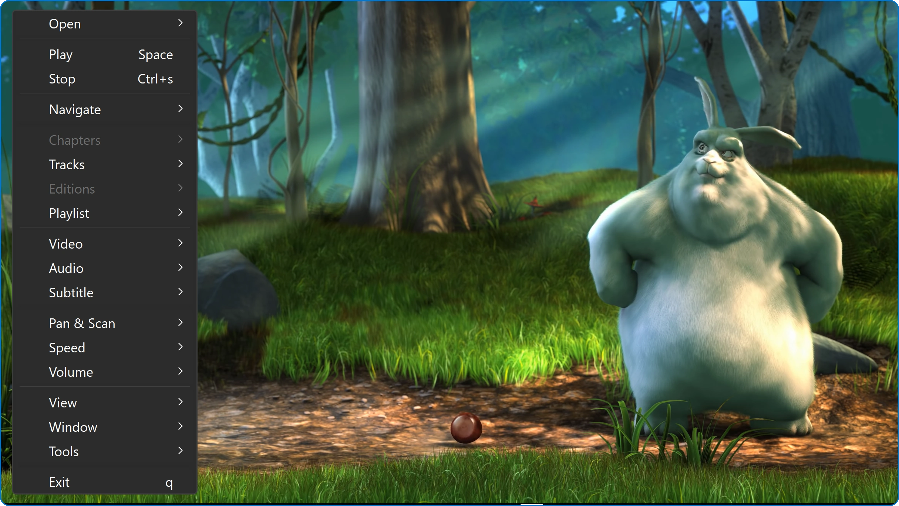

# mpv-hero

mpv media player from zero to hero.

mpv-hero consists of:

- Original/Vanilla mpv.
- Some user scripts and tools that make mpv more feature rich, useful and beginner friendly.
  There is a feature rich and easy to use context menu.
- Reasonable default values.

Included user scripts and tools:

- [mpv-menu-plugin](https://github.com/tsl0922/mpv-menu-plugin) - The context menu.
- [uosc](https://github.com/tomasklaen/uosc) - Feature-rich minimalist proximity-based UI for MPV player.
- [thumbfast](https://github.com/po5/thumbfast) - High-performance on-the-fly thumbnailer script.
- [recent-menu](https://github.com/natural-harmonia-gropius/recent-menu) - Showing recently played files.
- [command_palette](https://github.com/stax76/mpv-scripts) - A searchable menu.

